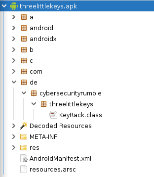

# Overview
---

**Name:** Three Little Keys

**Category**: 📱 Mobile

**Difficulty**: 🟠 Medium

**Description**: Once upon a time, there were three little keys safeguarding a secret flag. Combine and conquer!

**Hints**:
- Let the keys speak to you.
- The force may be with you at the end.

---

# Solution

We will need the following tools to analyse the Android application (APK):
- Android Emulator (or rooted Android device)
- Decompiler (e.g [jadx](https://github.com/skylot/jadx) or [ByteCodeViewer](https://github.com/Konloch/bytecode-viewer))

## 1. Dynamic analysis

As a first step, let's determine what the app's purpose is. To do so, we install the app on an emulator or physical device and launch it.

▶️ **Install the app**

```shell
$ adb install threelittlekeys.apk
Performing Streamed Install
Success
```


▶️  **Launch the app and interact with it**


- We can see three keys on which we can tap.
- Tapping on the first key will show the following message: *First key found. Did you see it?*
- Tapping on the second key shows an input field. If we enter some random input, we will see the message: *Your second key is incorrect.*
- Tapping on the third key will show the following message: *Your third key is incorrect. Did you look in the right place?*

The icon of the first key is green as the key was found, but we didn't see it on the screen. There are two more places where we can look: the filesystem and the device log.

▶️  **View the device log**

1. Determine the app's package ID

```shell
$ adb shell pm list packages | grep key
package:com.android.keychain
package:de.cybersecurityrumble.threelittlekeys
```

2. Find out the process ID of the running app instance

```shell
$ adb shell pidof de.cybersecurityrumble.threelittlekeys
16103
```

3. View the device log, filtering out the log entries for our app

```shell
$ adb logcat | grep -i 16103
09-18 20:13:49.078   266   266 D Zygote  : Forked child process 16103
--- SNIP ---
09-18 20:15:01.424 16103 16103 I Key Created: 7765
09-18 20:15:20.242 16103 16103 I AssistStructure: Flattened final assist data: 1468 bytes, containing 1 windows, 7 views
09-18 20:15:27.723 16103 16103 D KeyHelper: length=5; index=5
09-18 20:15:39.460 16103 16103 D KeyHelper: length=0; index=1
09-18 20:15:44.490 16103 16103 D Key Found: 

```
- The log contains an entry `Key Created: 7765`
- If we tap on the first key again, the log entry is repeated, meaning this has to be the first key.


▶️  **View the app storage**

1. Connect to the device

```shell
$ adb root
restarting adbd as root
$ adb shell
generic_x86:/ # 
```

2. List the contents of the app directory

```shell
generic_x86:/ # ls -laR /data/data/de.cybersecurityrumble.threelittlekeys/                                                    
/data/data/de.cybersecurityrumble.threelittlekeys/:
total 44
drwx------   5 u0_a127 u0_a127       4096 2022-09-18 20:13 .
drwxrwx--x 159 system  system        8192 2022-09-18 20:00 ..
drwxrws--x   2 u0_a127 u0_a127_cache 4096 2022-09-18 20:00 cache
drwxrws--x   2 u0_a127 u0_a127_cache 4096 2022-09-18 20:00 code_cache
drwxrwx--x   2 u0_a127 u0_a127       4096 2022-09-18 20:13 shared_prefs

/data/data/de.cybersecurityrumble.threelittlekeys/cache:
total 16
drwxrws--x 2 u0_a127 u0_a127_cache 4096 2022-09-18 20:00 .
drwx------ 5 u0_a127 u0_a127       4096 2022-09-18 20:13 ..

/data/data/de.cybersecurityrumble.threelittlekeys/code_cache:
total 16
drwxrws--x 2 u0_a127 u0_a127_cache 4096 2022-09-18 20:00 .
drwx------ 5 u0_a127 u0_a127       4096 2022-09-18 20:13 ..

/data/data/de.cybersecurityrumble.threelittlekeys/shared_prefs:
total 24
drwxrwx--x 2 u0_a127 u0_a127 4096 2022-09-18 20:13 .
drwx------ 5 u0_a127 u0_a127 4096 2022-09-18 20:13 ..
-rw-rw---- 1 u0_a127 u0_a127  110 2022-09-18 20:13 ThreeLittleKeys.xml
```

- We can three folders and one file in the `shared_prefs` folder.

3. Show the contents of `ThreeLittleKeys.xml`

```shell
cat /data/data/de.cybersecurityrumble.threelittlekeys/shared_prefs/ThreeLittleKeys.xml
<?xml version='1.0' encoding='utf-8' standalone='yes' ?>
<map>
    <string name="KeyChain">2a</string>
</map>
```

- We can see a key `KeyChain` which has the value `2a`

---

✍️ **Our results so far**
- To solve the challenge we need three keys.
- The first key is `7765`
- The second key has to be entered
- No hints for the third key so far.
- There is a `KeyChain` value of `2a` which we might need at some point

---


## 2. Static analysis
Let us decompile the app and see if the source code reveals more information on the second and third key.

▶️  **Launch a decompiler of your choice and open the APK**

*In the following steps, ByteCodeViewer is used with the JADX and Procyon decompilers.*



Based on the short class names `a`, `b`, `c`, we can see that the code has been (partially) minified, which will make it a little harder to read.
In the app package there is only one class `KeyRack`, so we will start our analysis there.

▶️  **Open the `KeyRack` class and analyze its contents**

We can see three functions that fit the three keys:
- `onClickFirstKey`
- `onClickSecondKey`
- `onClickThirdKey`

There is another function `onClickUnlock` for which we didn't see any button.
Most functions call a check function within class `c`, so we should give this class a closer look.

```java
public void onClickFirstKey(View view) {
    try {
	// ...
        boolean checkFirstKey = c.getInstance().checkFirstKey();	
        // ...		 
	} catch (IllegalArgumentException e) {
        z(e.getMessage(), false);
    }
}


public void onClickThirdKey(View view) {
    try {
        boolean checkThirdKey = c.getInstance().checkThirdKey();
	// ...
    } catch (IllegalArgumentException e) {
        z(e.getMessage(), false);
    }
}

public void onClickUnlock(View view) {
    try {
        String openLock = c.getInstance().openLock();
	// ...
    } catch (Exception unused) {
       str = "Something is wrong with your keys.";
    }
}
```

▶️  **Open the `c` class (in package `c.a.a`) and analyze the flag**

We can see a `FLAG` value as a byte array:

```java
FLAG = new byte[] { 9, 122, -88, 120, -13, -71, 85, 104, 90, 115, 12, -91, -65, 54, -89, 96, -52, 74, 106, 82, 101, -14, 41, -56, -119, -46, 55, -40, -125, 43, -127, -4, -114, -113, 86, 35, 31, -18, -81, -56, -127, 102, -48, 22, 76, 62, 101, 127 }
```

If we try decoding the byte array directly (e.g with [CyberChef](https://cyberchef.org/), using the *From Decimal* function), we will get an error. This means, the flag is encrypted.

Scrolling further down, we see how the flag is decrypted in the `openLock` function:

```java
public String openLock() {
    // We have three strings, probably corresponding to the three keys
    String str = this.a;  
    String str2 = this.b;  
    String str3 = this.f0c;
    // We have the KeyChain value we spotted in the shared preferences  
    String string = d.a().a.getString("KeyChain", "");
    // The first two strings and the KeyChain value get concatenated and transformed into a byte array using function a()  
    byte[] a = a(str + string + str2 + string);
    // The third string is directly converted into a byte array  
    byte[] bytes = str3.getBytes();
    // Both byte arrays are concatenated  
    byte[] bArr = new byte[a.length + bytes.length];  
    System.arraycopy(a, 0, bArr, 0, a.length);  
    System.arraycopy(bytes, 0, bArr, a.length, bytes.length);
    // The concatenated array is used to create a key  
    SecretKeySpec secretKeySpec = new SecretKeySpec(bArr, "AES");  
    try {
	// The key is used to decrypt the flag  
        byte[] bArr2 = FLAG;  
        Cipher instance = Cipher.getInstance("AES/ECB/PKCS5Padding");  
        instance.init(2, secretKeySpec);  
        return new String(instance.doFinal(bArr2), "UTF-8");  
    } catch (Exception e) {  
        Log.d("KeyHelper", e.getMessage());  
        return "";  
    }  
}
```

Summing up, our master key for decryption looks like this:

```text
  string-to-bytes-with-a(77652a<second_key>2a)
+ string-to-bytes(third_key)
```


▶️  **Analyze the second key**

We can see that the JADX decompiler could not decompile the `checkSecondKey` function, but the Procyon decompiler shows how the check is done.
We can see four values initialized with `0` that are either set to `0` or `1` in some `if` clauses. This indicates that these are boolean values that are checked again at the end of the function before returning the final `true/false` result. So, plainly speaking, the second key - passed as string `b` - must fulfil four conditions.

```java
public boolean checkSecondKey(final String b) {  
    this.b = b;  
    boolean b2 = true;  
    int n = 0;  
    int n2 = 0;  
    int n3 = 0;  
    int n4 = 0;
    //...
    if (this.b.isEmpty() || n4 == 0 || n2 == 0 || n3 == 0 || n == 0) {  
        b2 = false;  
    }  
    return b2;  
}
```

*Condition* 1️⃣

```java
if (b.charAt(1) == 'c') {  
    n = 1;  
}
```

The first condition is a simple check whether the character at position 1 is a `c`.


*Condition* 2️⃣
```java
if (b.charAt(0) == b.charAt(2) && b.charAt(2) == b.charAt(5) && b.charAt(5) == b.charAt(6)) {  
     n2 = 1;  
}
```

The second condition requires the characters at position 0, 2, 5 and 6 to be the same.


*Condition* 3️⃣

```java
final byte[] a = a(b);  
final String s = new String(a);  
if (s.length() == 4 && s.charAt(3) == 'e') {  
    n3 = 1;  
}
```

For the third condition, the second key string `b` is first converted to a byte array using function `a()`. The byte array is then turned into a string. This string has to be of length 4 and have the letter `e` at the end (as arrays start counting at 0, the third position is the last of a string with length 4).

We have seen the `a()` function being used before when we analysed how the flag gets decrypted. Time to have a closer look at this function.

```java
public static byte[] a(final String s) {
    // A new, empty byte array is created that is half as long as the string passed to the function
    final int length = s.length();  
    final byte[] array = new byte[length / 2];
    // We loop in steps of two   
    for (int i = 0; i < length; i += 2) {  
        // We get the numeric value of the second character in radix 16, and add to it the numeric value of the first character with bytes shifted to the left by 4
        array[i / 2] = (byte)(Character.digit(s.charAt(i + 1), 16) + (Character.digit(s.charAt(i), 16) << 4));  
    }  
    return array;  
}
```
What looks quite complicated is actually a simple conversion of a hex string to a byte array. We can either just ask Google for help and it will lead us to corresponding source code examples or we do it the hard way and figure it out ourselves:

- We've seen the function `a()` been used with the first key `7765`, so we can assume this is valid input.
- When `7765` is passed as string, it has a length of 4. Our resulting byte array will be half as long, thus have a length of 2.
- The first iteration will take the first two characters: `digit(7, 16) + (digit(7, 16) << 4)`
- `digit(7, 16)`  means the value of 7 in the numeral system with base 16, i.e. in the hexadecimal number system. 7 remains 7 in the hexadecimal system, so we get: `7 + (7 << 4)`
- For the left shift, we first need to convert `7` into bytes: `0000 0111`
- Shifting these to the left by four (filling the new bytes with 0) gives us `0111 0000` which equals 112
- This means `77` becomes `7 + 112 = 119`
- Repeating the same steps for `65`, we get `5 + (6 << 4) = 5 + 96 = 101`

So we know that our second key input has to be a hexadecimal string, which can be converted to a "normal" string of length 4. The input string thus has to be of length 8. The last "normal" character is an `e` which corresponds to `65` in the hexadecimal system.

Using what we learned from those first three conditions, our second key has to be as follows:

| 0 | 1 | 2 | 3 | 4 | 5 | 6 | 7 |
| --- | --- | --- | --- | --- | --- | --- | --- |
| `6` | `c` | `6` | `?` | `?` | `6` | `6` | `5` |

If we convert this to a "normal" string, we get `l__e`. 

At this point we could just start guessing potential words (e.g. *live*, *like*, *love*, *lite*, *lone*,...), convert them to hex strings and see which ones fit the pattern (e.g. *live* = `6c697665` ✔️, *like* = `6c696b65` ❌).

Or we take a look at the last condition.


*Condition* 4️⃣

```java
final byte[] a = a(b);
//...
byte b3 = a[0];  
int i = 1;  
try {  
    while (i < a.length) {  
        b3 &= a[i];  
        ++i;  
    }  
    n4 = n;  
    n5 = n2;  
    n6 = n3;  
    if (b3 == 100) {  
        final int n7 = 1;  
        n4 = n;  
        n = n7;  
        break Label_0246;  
    }  
    break Label_0237;  
}
```

The fourth condition again uses the byte array that was created in the check of the third condition. We take the first byte and then loop through the entire byte array, doing a bitwise `and` operation with all the bytes in the array. The result (`b3`) of these bitwise operations has to equal `100`.
As we are talking bitwise operations, let's convert what we already have to the corresponding binary values.

As a reminder, here the truth table for `AND` operations:

| A | B | Result |
| :---: | :---: | :---: |
| `0` | `0` | `0` |
| `0` | `1` | `0` |
| `1` | `0` | `0` |
| `1` | `1` | `1` |

Results based on the truth table:

| Letter | Hex | Binary | Filled in with truth table |
| :---: | :---: | :---: | :---: |
| `l` | `6c` | `0110 1100` | `0110 1100` |
| `?` | `6?` | `0110 ????` | `0110 ?1??` |
| `?` | `?6` | `???? 0110` | `?11? 0110` |
| `e` | `65` | `0110 0101` | `0110 0101` |
| Result `100` | | `0110 0100` | `0110 0100` |

We still have some gaps:
- the fourth (hex) value could be: `4 5 6 7 c d e f` giving us the following potential letters: `d e f g l m n o`
- the fifth (hex) value could be: `6 7 e f` giving us the following potential letters: `f v æ ö`

Assuming that the second key is a real word, the only combination that makes sense is: `love` which is in hex `6c6f7665`.


▶️  **Analyze the third key**

```java
public boolean checkThirdKey() {  
    String string = d.a().a.getString("ThirdKey", "");  
    this.f0c = string;  
    Log.d("Key Found", string);  
    boolean z = !this.f0c.isEmpty() && Pattern.compile("\\d{2}[*!=()%?$#]\\p{Upper}\\d+!").matcher(this.f0c).find() && this.f0c.length() == 8 && this.f0c.charAt(0) == this.f0c.charAt(6) && this.f0c.charAt(1) == this.f0c.charAt(4);  
    if (this.f0c.isEmpty() || z) {  
        return !this.f0c.isEmpty() && z;  
    }  
    throw new IllegalArgumentException("You're looking at the right place, but are still missing something.");  
}
```

The third key is loaded from somewhere with `d.a().a.getString("ThirdKey", "");`. We have seen this method before when analysing the `openLock()` function:

```java
String string = d.a().a.getString("KeyChain", "");
```

Based on our dynamic analysis, we know that this refers to loading the `KeyChain` value from the shared preferences. This means our third key is supposed to be loaded from the shared preferences, but there isn't anything in there.

The third key string then has to match three conditions:

- not empty: `!this.f0c.isEmpty()`
- match a regular expression: `Pattern.compile("\\d{2}[*!=()%?$#]\\p{Upper}\\d+!").matcher(this.f0c).find()`
	- two decimal values at the beginning
	- one of the following special characters: `*!=()%?$#`
	- an uppercase letter
	- one or more decimal values
	- an exclamation mark `!` at the end
- length of 8 characters: `this.f0c.length() == 8`
- the characters at position 0 an 6 have to match: `this.f0c.charAt(0) == this.f0c.charAt(6)`
- the characters at postion 1 and 4 have to match: `this.f0c.charAt(1) == this.f0c.charAt(4)`

This is all the information we get on the third key, which means, we will have to brute force all possible combinations fitting this pattern:

| 0 | 1 | 2 | 3 | 4 | 5 | 6 | 7 |
| --- | --- | --- | --- | --- | --- | --- | --- |
| `0-9` | `0-9` | `*!=()%?$#` | `A-Z` | *same as 1* | `0-9` | *same as 0* | `!` |

This gives us `10 * 10 * 9 * 26 * 10 = 234000` possible combinations.

---

✍️ **Our results so far**
- Key parts:
	- 🗝️ `7765` (we)
	- 🗝️ `6c6f7665` (love)
	- 🗝️ `0-9 | 0-9 | *!=()%?$# | A-Z | same as 1 | 0-9 | same as 0 | !`
- Master key for decryption:
	hexStringToByteArray(`77652a6c6f76652a`) + byteArray(third_key)

---

## 3. Getting the flag

To decrypt the flag, we need a master key that is assembled from the three keys linked together with the `KeyChain` value `2a`. We don't know the exact value of the third key, so we will have to brute force it.

The following Python script mimics the decrypt function and brute forces the third key:

```python
from Crypto.Cipher import AES
from string import ascii_uppercase  
  

def decrypt(enc_text, secret):
	# In the decompiled source code we can see that AES/ECB/PKCS5Padding
	# is used for en-/decryption. We can use Python's Crypto library to
	# do the same.
	# Create cipher with master key
	cipher = AES.new(secret, AES.MODE_ECB)
	# Decrypt flag byte array
	decrypted = cipher.decrypt(enc_text)
	# Remove the padding
	unpadded = decrypted[:-ord(decrypted[-1:])]
	# Convert byte string to normal string
	return unpadded.decode("utf-8")  
  

if __name__ == "__main__":
	# The FLAG from the decompiled code is a decimal byte array.
	# If we copy it over as is, it will become a normal list in Python.
	java_flag = [9, 122, -88, 120, -13, -71, 85, 104, 90, 115, 12, -91, -65, 54, -89, 96, -52, 74, 106, 82, 101, -14, 41, -56, -119, -46, 55, -40, -125, 43, -127, -4, -114, -113, 86, 35, 31, -18, -81, -56, -127, 102, -48, 22, 76, 62, 101, 127 ]
	# So we convert it to a Python byte array
	python_flag = bytes([x % 256 for x in java_flag])  
	
	# We assemble the keys parts we know
	first_key = "7765"
	second_key = "6c6f7665"
	key_chain = "2a"
	# And build the first part of the master key by converting the concatenated
	# hex strings into a byte array
	first_part = bytes.fromhex(first_key + key_chain + second_key + key_chain);
	
	
	# Start with an empty third key
	third_key = ""
	special_chars = "*!=()%?$#"
	# Build strings that meets the regex pattern
	# First two decimal characters: 00 to 99
	for number in range(100):
		first_two = f"{number:02d}"
		# Third character
		for char in special_chars:
			# Fourth character
			for letter in ascii_uppercase:
				# Fifth character is the same as the second
				fifth = first_two[1]
				# Sixth character is a decimal
				for num in range(10):
					sixth = str(num)
					# Seventh character is the same as the first
					seventh = first_two[0]
					# Eighth character is an exclamation mark
					third_key = first_two + char + letter + fifth + sixth + seventh + "!"  
					
					# Convert key to byte array
					second_part = bytes(third_key, "utf-8")
					# Concatenate both key parts
					master_key = first_part + second_part
					# Try decryption
					try:
						decrypted_flag = decrypt(python_flag, master_key)
						# All flags start with "CSR", so we check if the decrypted string contains it
						if "CSR" in decrypted_flag:
							print("Key: " + third_key + "\tFLAG: " + decrypted_flag)
					except UnicodeDecodeError:
						pass
```
Let's run the script:

```shell
$ python3 getflag.py
Key: 53(R375!   FLAG: CSR{It_is_d4ng3r0us_to_go_4l0n3}
```

---

🏁 **Flag**

`CSR{It_is_d4ng3r0us_to_go_4l0n3}`

(Master key: `we*love*53(R375!`)

---
